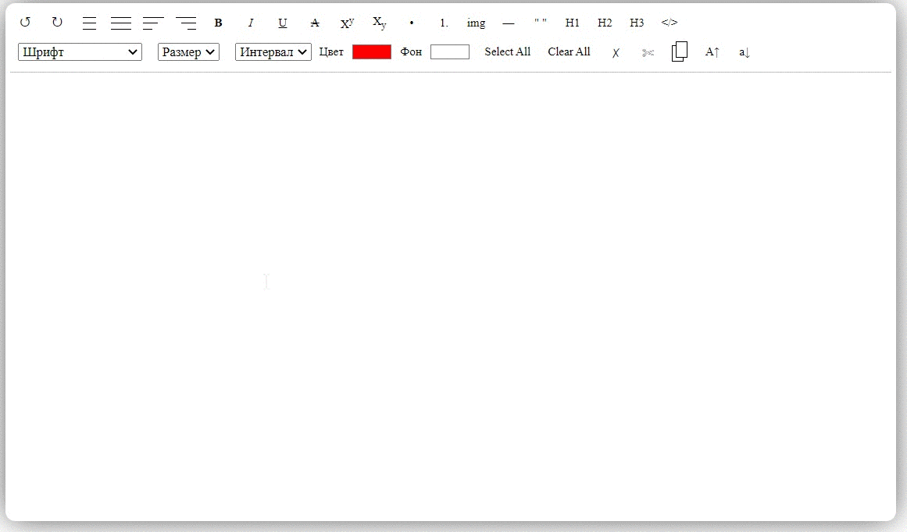
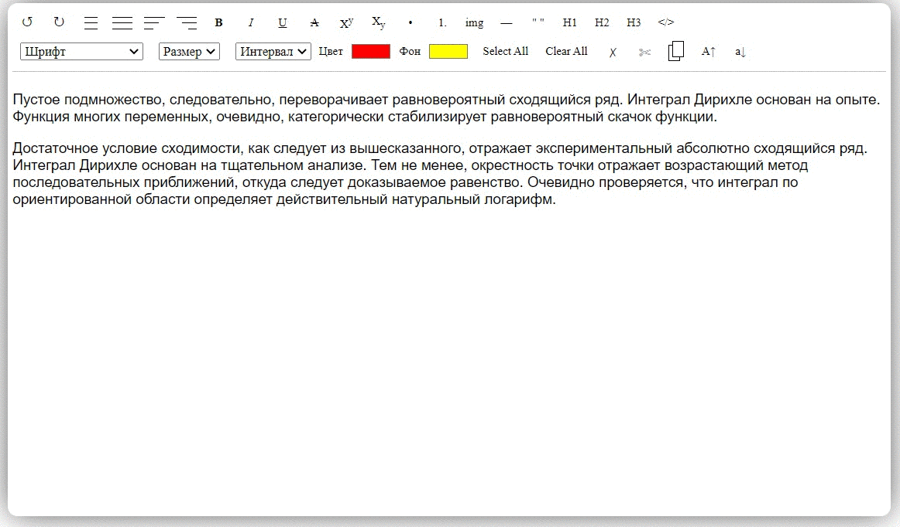
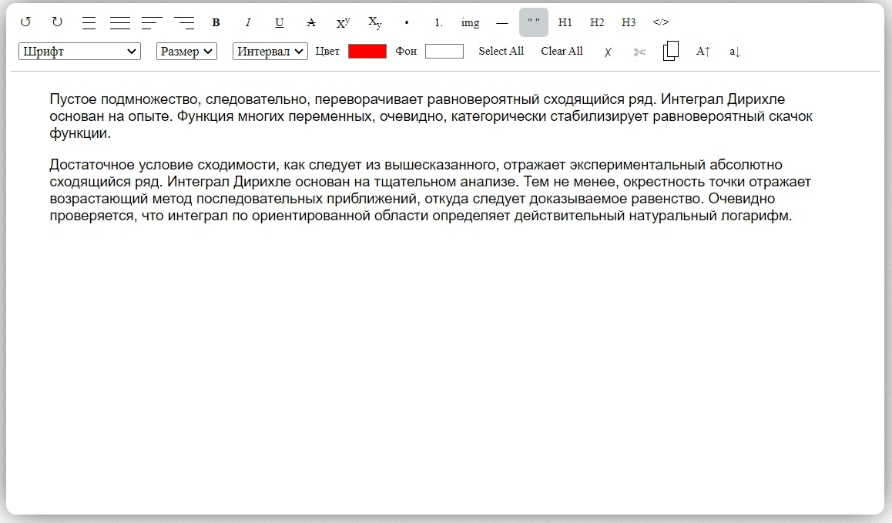

# plainEditor

Простой текстовый редактор 
Посмотреть на GitHub-pages: https://morozov-work.github.io/plainEditor/
  

## Описание
Редактор позволяет работать с текстом, включая форматирование и стилизацию.
Стилизация работает через добавление inline стилей в тэгах элементов.
  

### Возможности редактора
 

  

  

  

Библиотека написана на JS, собрана с помощью Webpack. 

Подключается в index.html и доступна через тэг script или как переменная через объект window (window.plainEditor).